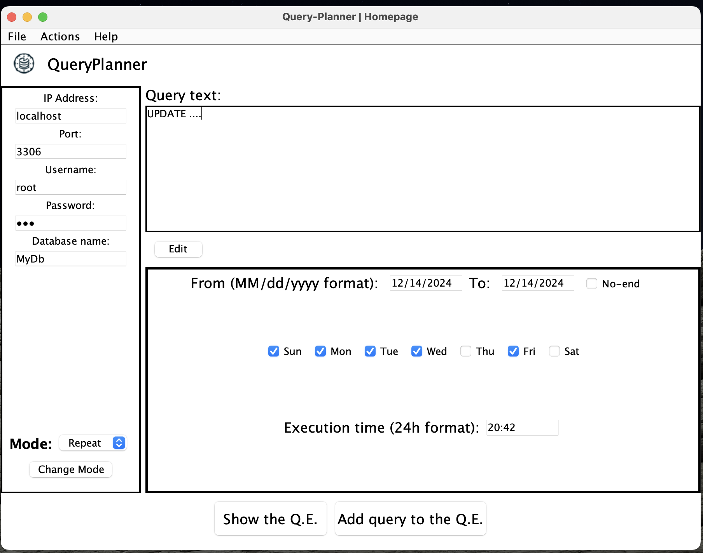
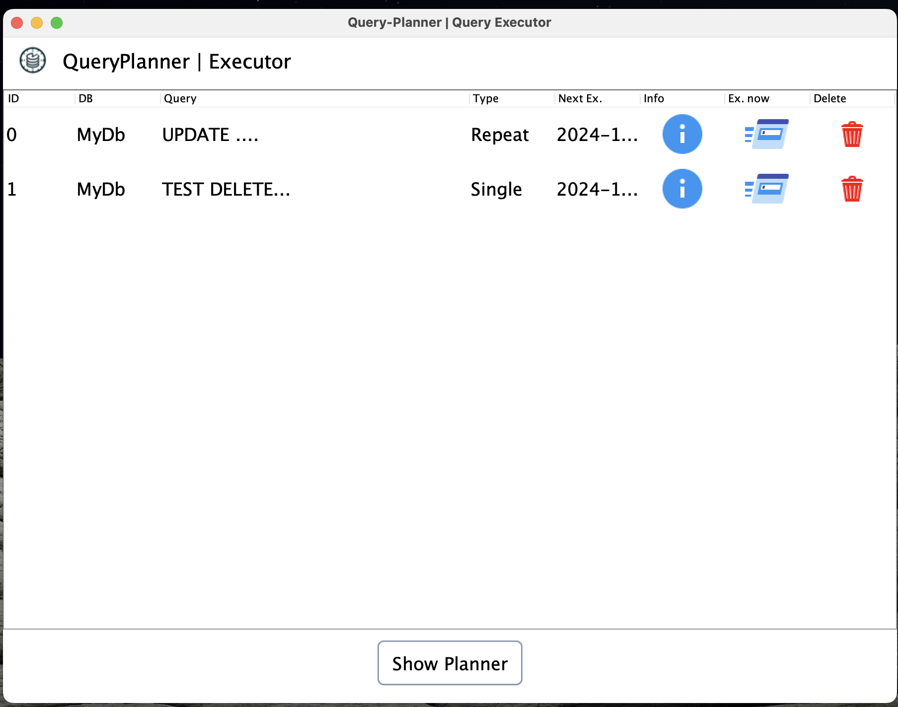

# QueryPlanner Project Documentation

## 1. Introduction
QueryPlanner is a Java application designed to allow users to schedule and manage the execution of queries on a MySQL database. The system enables users to define programmable queries with options for recurring execution, date and time management, and database connection parameter configuration.



## 2. Main Features
- **Query Scheduling**: Users can define SQL queries to be executed at specific intervals or at a precise date and time.
- **Database Connection**: Configure connection parameters such as IP address, port, username, password, and database name.
- **Scheduling Management**: Queries can be configured to repeat on a daily, weekly, or monthly basis, with an optional date range during which the query will be executed.
- **Execution Type Management**: Supports one-time or recurring executions based on configuration.

## 3. Project Structure
The project is organized into various packages and core classes:
- **ScheduledQuery**: Manages the configuration of scheduled queries.
- **Validator**: Contains validation methods for connection and scheduling information.
- **DatabaseConnector**: Responsible for connecting to the MySQL database and executing queries.

## 4. Database File `QueryDatasFile.qpl`
The `QueryDatasFile.qpl` file is used to store information about scheduled queries. It is a plain text file containing the necessary data to execute the scheduled queries, including database connection details, execution parameters, and specific query settings.

### File Format
The `QueryDatasFile.qpl` file is structured in a human-readable text format, with each line representing a single scheduled query. Fields are separated by a delimiter (such as a comma or semicolon). An example line might look like: ```idQuery,ipAddress,port,user,password,dbName,queryText,type,startDate,endDate,executionTime,weekDays 1,192.168.1.100,3306,admin,password,TestDB,"UPDATE ...",01/01/2024,12/31/2024,10:00,1,0,1,0,0,1,0```

### Description of Fields
- **idQuery**: Unique identifier for the query.
- **ipAddress**:
  - IP address of the database.
- **port**:
  - Port for the database connection.
- **user**:
  - Username for the database login.
- **password**:
  - Password for the database login.
- **dbName**:
  - The name of the database to execute the query on.
- **queryText**:
  - The SQL query to execute.
- **type**:
  - Type of execution ("repeat" for recurring executions, "one-time" for a single execution).
- **startDate**:
  - Start date for query execution.
- **endDate**:
  - End date for query execution (optional for repeated executions).
- **executionTime**:
  - Time for query execution.
- **weekDays**:
  - An array representing the days of the week when the query should be executed (1 for executed, 0 for not executed).
 
  - 


## 6. Requirements
- **Java**: The project is developed using Java, so a recent version of the JDK is required.
- **MySQL**: A functioning MySQL connection is needed to execute the queries.
- **Maven**: Maven is used for dependency management.

## 7. Running the Project

### Configure Dependencies:
Ensure Maven is installed. Add the necessary dependencies for MySQL in the `pom.xml` file:

```xml
<dependency>
    <groupId>mysql</groupId>
    <artifactId>mysql-connector-java</artifactId>
    <version>8.0.26</version>
</dependency>
```
## 8. Cloning the Project

You can clone the QueryPlanner project from the official GitHub repository:

```bash
git clone https://github.com/your-username/queryplanner.git
```

Once the project is cloned, navigate to the project folder:

```bash
cd queryplanner
```

Install dependencies with Maven:
```bash
mvn install
```

## 9. Icon Usage

The icons used in the project are sourced from [Icons8](https://icons8.com), which offers a wide set of free icons for use in software projects. You can find more free and licensed icons under the Icons8 License at the following link: [Icons8 Icons](https://icons8.com/icons).

The icons used in this project are intended for non-commercial or educational purposes as per Icons8's license terms.

## 10. MIT License

This project is licensed under the MIT License. You are free to use, modify, and distribute this software, but without any warranties.


